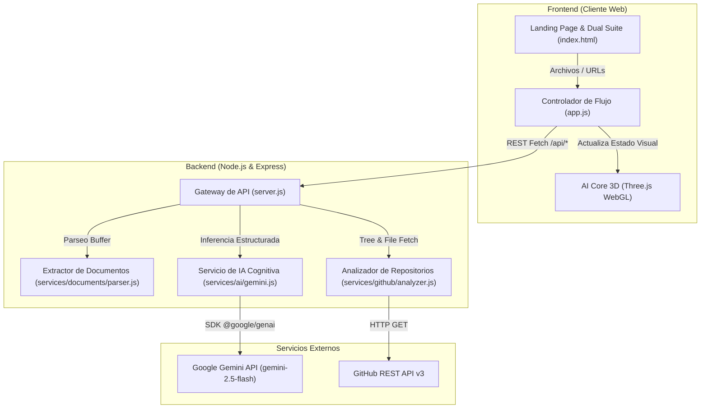

# Document-Mind AI — Plataforma Cognitiva de Análisis de Documentos y Repositorios

> **Iniciativa de Emprendimiento de Base Tecnológica**  
> **Universidad Libre — Facultad de Ingeniería**  
> **Asignatura:** Ingeniería Aplicada / Emprendimiento Tecnológico  
> **Versión:** 1.0.0 (Producción Funcional)

---

## 👥 Equipo Empresarial & Roles

- **Daniel Santiago Palencia Sandoval** — *Líder Tecnológico (CTO)*
  - **Correo Institucional:** [daniels-palencias@unilibre.edu.co](mailto:daniels-palencias@unilibre.edu.co)
  - **GitHub:** [https://github.com/DsantiagoPsandoval](https://github.com/DsantiagoPsandoval)
  - **LinkedIn:** [https://www.linkedin.com/in/daniel-palencia-palencia-sandoval-b49279351/](https://www.linkedin.com/in/daniel-palencia-palencia-sandoval-b49279351/)
  - *Funciones:* Arquitectura de software, integración de modelos de lenguaje Google Gemini, pipeline de análisis de documentos (PDF, DOCX, TXT), cliente de análisis de repositorios GitHub REST v3, núcleo 3D WebGL con Three.js y suite de pruebas automatizadas.

- **Nelson Andrés Ayala Álvarez** — *Líder de Mercadeo & Desarrollo de Negocios (CMO/CBO)*
  - **Correo Institucional:** [nelsona-ayalaa@unilibre.edu.co](mailto:nelsona-ayalaa@unilibre.edu.co)
  - **GitHub:** [https://github.com/nexker](https://github.com/nexker)
  - **LinkedIn:** [https://www.linkedin.com/in/nelson-ayala-11719a352](https://www.linkedin.com/in/nelson-ayala-11719a352)
  - *Funciones:* Construcción y despliegue de la Landing Page interactiva, adquisición de early adopters, entrevistas de validación con Tech Leads/CTOs, diseño UX/UI accesible (WCAG 2.1 AAA) y estructuración del modelo SaaS B2B.

---

## 🌟 ¿Qué es Document-Mind AI?

**Document-Mind AI** es una plataforma web full-stack de inteligencia artificial diseñada para desarrolladores, líderes técnicos y equipos de ingeniería. Permite transformar código fuente desorganizado y documentación técnica extensa en conocimiento estructurado, sintetizado y accionable en segundos.

### Capacidades Principales:
1. **Analizador de Documentos Técnicos:**
   - Carga mediante drag-and-drop o explorador de archivos para `.pdf`, `.docx`, `.txt` y `.md` (hasta 10 MB).
   - Extracción de texto real en servidor con `pdf-parse` y `mammoth`.
   - Generación de: **Resumen Ejecutivo**, **Ideas Principales**, **Conceptos Clave**, **Conclusiones Fundamentadas**, **Preguntas de Estudio** y **Explicaciones Multinivel** (Básico, Intermedio y Avanzado).
   - **Chat Contextual Fundamentado:** Consulta interactiva paso a paso basada estrictamente en el contenido del documento cargado.

2. **Analizador de Repositorios GitHub:**
   - Validación y parseo de URLs públicas de GitHub.
   - Extracción del árbol de directorios mediante GitHub REST API v3 con filtrado inteligente (ignora `node_modules`, `.git`, binarios, bundles y assets).
   - Extracción con presupuesto de tokens de archivos críticos (`package.json`, `README.md`, arquitecturas, configuración).
   - Detección automática del stack tecnológico y dependencias.
   - Diagnóstico estructurado categorizado en: **Confirmado**, **Posible Problema** y **Recomendación**.
   - **Chat Contextual con el Repositorio:** Preguntas y respuestas fundamentadas en la estructura de archivos y código del repositorio.

3. **Núcleo 3D Interactivo (AI Core):**
   - Construido con **Three.js** y **WebGLRenderer** nativo con sombreado de luz orbital.
   - Sincronización visual en tiempo real con los estados del backend: `IDLE`, `LOADING`, `PROCESSING`, `ANALYZING`, `SUCCESS`, `ERROR`.

4. **Historial de Sesión Persistente:**
   - Almacenamiento local con `localStorage` de todos los análisis realizados para consulta rápida sin re-procesamiento.

5. **Modo Dual de Procesamiento:**
   - **Modo Cognitivo Gemini 2.5 Flash:** Inferencia generativa profunda conectándose a la API oficial de Google Gemini (`@google/genai`).
   - **Modo Heurístico Determinista Offline:** Si no se suministra una clave de API, el servidor continúa operando de forma 100% real extrayendo texto, árboles y estadísticas sin generar errores de red ni mocks artificiales.

---

## 🏗️ Arquitectura del Sistema



---

## 📋 Requisitos Previos

- **Node.js:** Versión 18.0.0 o superior instalada.
- **NPM:** Incluido con Node.js.
- *(Opcional pero recomendado)* **Cuenta y Proyecto en Supabase:** Crea un proyecto gratuito en [Supabase](https://supabase.com) para autenticación y base de datos PostgreSQL.
- *(Opcional)* **Personal Access Token de GitHub:** Para repositorios con alto volumen o para incrementar los límites de tasa de GitHub API.

---

## 🚀 Instalación y Puesta en Marcha

### Paso 1: Clonar o abrir el repositorio
Abre una terminal en la carpeta raíz del proyecto:
```bash
cd c:\Users\danis\Documents\IngenieriaAplicada
```

### Paso 2: Instalar dependencias
Ejecuta el gestor de paquetes de Node:
```bash
npm install
```
*(En Windows PowerShell, si tienes restricciones de script, usa `npm.cmd install`)*.

### Paso 3: Configurar la Base de Datos en Supabase
1. Ingresa a tu panel en [Supabase Dashboard](https://supabase.com/dashboard) y crea o selecciona tu proyecto.
2. Dirígete a la sección **SQL Editor** (en el menú lateral izquierdo).
3. Haz clic en **"New query"** y copia el contenido íntegro del archivo:
   👉 **[`supabase/schema.sql`](supabase/schema.sql)**
4. Presiona **"Run"** para ejecutarlo. Esto creará:
   - Tabla `profiles` vinculada con `auth.users` mediante triggers automáticos.
   - Tabla `analyses` con soporte para documentos y repositorios.
   - Políticas de seguridad **Row Level Security (RLS)** para aislar la información de cada usuario.

### Paso 4: Configurar variables de entorno
Copia la plantilla de entorno `.env.example` a un archivo `.env`:
```bash
copy .env.example .env
```
Abre el archivo `.env` con tu editor preferido y define tus claves:
```env
PORT=3000
GEMINI_API_KEY=tu_clave_de_gemini_aqui
AI_MODEL=gemini-2.5-flash
GITHUB_TOKEN=

# Credenciales de Supabase (Project Settings -> API):
SUPABASE_URL=https://tu-proyecto.supabase.co
SUPABASE_ANON_KEY=tu_supabase_anon_key_aqui
```
> [!NOTE]
> - Si dejas `GEMINI_API_KEY` vacío, el sistema funcionará en **Modo Heurístico Determinista**, extrayendo el contenido real de los documentos y repositorios sin detenerse.
> - Si dejas `SUPABASE_URL` vacío, la aplicación continúa operativa en modo invitado guardando el historial de forma local en `localStorage`.

### Paso 5: Iniciar el servidor
Inicia el servidor Express en producción local:
```bash
npm start
```
Verás la confirmación en la consola:
```
====================================================
🚀 DOCUMENT-MIND AI — Servidor Activo
🌐 URL Local: http://localhost:3000
🤖 Proveedor IA: Google Gemini (gemini-2.5-flash)
🔑 Clave API: Configurada ✔
⚡ Supabase DB/Auth: Configurada ✔
====================================================
```

### Paso 6: Abrir la aplicación
Abre tu navegador web e ingresa a:
👉 **[http://localhost:3000](http://localhost:3000)**

---

## 🧪 Ejecución de Pruebas Automatizadas

El proyecto incluye una suite de pruebas unitarias y de integración end-to-end con 13 verificaciones rigurosas:
- Validación de archivos nulos, formatos inválidos y límites de tamaño.
- Extracción textual real y conteo de palabras/caracteres.
- Parseo de URLs de GitHub y detección heurística de stack técnico.
- Respuestas del servicio cognitivo y chat contextual fundamentado.
- Endpoints de Express (`/api/health`, `/api/documents/*`, `/api/github/*`, `/api/config/supabase`).

Para ejecutar las pruebas:
```bash
npm test
```
*(En Windows PowerShell: `npm.cmd test`)*.

Salida esperada:
```
RESULTADOS: 12 pruebas exitosas, 0 pruebas fallidas.
```

---

## 💡 Guía Rápida de Uso

### 1. Análisis de Documentos
1. Dirígete a la sección **"Centro de Análisis Inteligente"** (o presiona en el menú **"Analizador"**).
2. Arrastra un archivo `.pdf`, `.docx`, `.txt` o haz clic en **"Examinar Archivo"**.
3. Haz clic en **"Iniciar Análisis"**. Observa cómo el AI Core 3D pasa dinámicamente por los estados de extracción y cognición.
4. Explora las secciones de resultados:
   - Resumen ejecutivo.
   - Pestañas de explicación multinivel (Básico, Intermedio, Avanzado).
   - Preguntas clave para evaluación.
5. Haz preguntas en el **Chat Contextual** inferior para obtener respuestas sustentadas exclusivamente en el documento.

### 2. Análisis de Repositorios GitHub
1. Cambia a la pestaña **"Analizar GitHub"**.
2. Ingresa la URL de cualquier repositorio público de GitHub (por ejemplo, `https://github.com/expressjs/express` o `https://github.com/facebook/react`).
3. Haz clic en **"Inspeccionar Repositorio"**.
4. Visualiza:
   - Tecnologías detectadas con versiones.
   - Árbol de archivos depurado y organizado.
   - Hallazgos clasificados con badges de severidad (*Confirmado*, *Posible Problema*, *Recomendación*).
5. Interactúa con el chat contextual del repositorio para indagar sobre la arquitectura o buscar archivos específicos.

### 3. Consulta del Historial
1. Haz clic en la pestaña **"Historial"**.
2. Podrás recargar en cualquier momento los resultados de análisis previos almacenados en tu sesión local.

---

## 📄 Infografía y Material Institucional

- **Infografía Oficial en Formato PDF:** `DocuMind_AI_Infografia_Color_UXUI.pdf`
- **Versión Web Interactiva de la Infografía:** `infografia.html`
- **Paleta de Color Oficial:**
  - *Midnight Dark:* `#090D16`
  - *Deep Slate:* `#0F172A`
  - *Tech Cyan:* `#38BDF8`
  - *Emerald Sync:* `#34D399`
  - *Indigo Logic:* `#818CF8`
- **Accesibilidad:** Diseñado con contraste superior a 7.2:1 bajo la norma **WCAG 2.1 AAA**.
